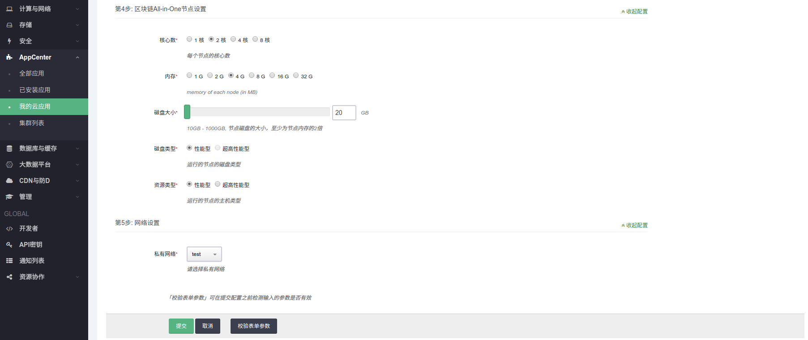

阿尔山区块链BaaS服务主要包括三种版本：

* 区块链平台BaaS服务预览版（Anychain BaaS Preview）

* 区块链平台BaaS服务试用版（Anychain BaaS Trial）

* 区块链平台BaaS服务企业版（Anychain BaaS Enterprise）

其中：

* 区块链平台BaaS服务预览版（Anychain BaaS Preview）

    预览版主要面向需要对区块链进行初步了解和学习的用户，该版本完全免费。它以Hyperledger Fabric 1.0社区版为基础，并对其进行了必要的性能优化，同时加入了我公司自主研发的区块链监控平台基础版。包括以下内容：

    + 区块链All-in-one平台
        * 4个区块链账本节点（部署在同一虚拟机内）

    + 区块链监控平台基础版
        * 1个监控节点
        * 1个代理节点

        该监控平台主要包含对区块链的Block，Transaction，TPS，TPP，等信息的监控。

    + 说明

        为达到演示效果，我们提供了一个内置样例智能合约，合约中有两个账户a和b。在区块链平台启动后会初始化两个账户及其余额，您可以通过BaaS提供的API接口执行用户a和b之间的转账操作和账户余额查询，详细使用说明请参考API接口部分。

        <b>系统会统计区块链运行状态信息，比如系统历史区块数量、交易数量等，并通过折线图在监控界面中展现出来，为更好的向用户展示统计功能以及观察区块以及交易的变化，我们会在后台每隔五分钟自动执行一批模拟的区块链转账交易。</b>

    + 部署手册
        * 登录[青云web管理终端](https://console.qingcloud.com)

        * 创建vpc网络

            计算与网络 -> vpc网络 -> 创建vpc网络 -> 填入vpc网络名称 -> 创建,见下图步骤:

            

        * 创建私有网络

            计算与网络 -> 私有网络 -> 创建 -> 填入私有网络名称 -> 提交, 见下图:

            

            然后选择该私有网络加入到vpc网络, 见下图步骤:

            

        * 申请公网IP

            计算与网络 -> 公网IP -> 申请 -> 填入公网IP名称 -> 提交，　见下图步骤：

            

            然后将申请的公网IP绑定到vpc网络，见下图步骤:

            

        * 部署区块链服务

            进入[青云官网AppCenter中心](https://appcenter.qingcloud.com/)，在”搜索应用”栏搜索”阿尔山区块链平台预览版”,进入应用后选择部署到QingCloud,对各个节点完成设置后(网络设置选择前面创建的私有网络)，如下图所示:

            

            

            

            

            在集群列表中可以看到有３个节点正在创建，角色分别是区块链节点,区块链监控节点和代理节点, 如下图所示:

            

        * 网络配置

            在上一步中，我们可以看到有3个角色创建(对应上图中左边红圈起来的部分),这些角色在创建完成后有对应的内网IP,接下来的网络设置中需要用到区块链监控节点的内网IP(上图中内网IP为192.168.0.3,这个内网IP是由青云调度生成的，在此假设为IP-1)以及代理节点的内网IP(对应上图中的192.168.0.4, 在此假设为IP-2),然后找到创建的vpc网络(计算与网络 -> vpc网络 -> 选择创建的vpc网络),选择管理配置 -> 端口转发 -> 添加规则，如下图所示:
            

            同理添加5000端口规则(内网IP填IP-1，源端口和内网端口均是5000),8001端口规则(内网IP填IP-1,源端口和内网端口均是8001),8003端口规则(内网IP填IP-1,源端口和内网端口均是8003),添加8100的端口规则(内网IP填IP-2,源端口和内网端口均是8100),完成后点击应用修改以更新vpc网络, 如下图所示:
            

            接下来需要对vpc网络中的防火墙进行配置，找到创建的vpc网络，看路由器属性中的防火墙的标识，进入防火墙设置(安全 -> 防火墙),根据标识找到对应的防火墙，点击进入防火墙的配置界面，对下行规则作配置，开放8100,8003端口,如下图所示:
            

        * 访问区块链监控平台

            http://公网IP:8100/#/blockchain(以用户名arxan,密码admin登录)

    + 可以使用的接口
        * 通过RESTful API可以进行如下操作
            * 调用智能合约

              * 交易发起接口，该接口向区块链平台发起一个交易

                + URL: http://公网IP:8003/api/v1/blockchain/invoke
                + 方法： POST
                + 参数格式： JSON
                + 参数：

                    ```
                    {
                       "payload": {
                          "chaincode_id": "mycc",
                          "args": ["invoke", "a", "b", "1"]
                       }
                    }
                    ```
                + 参数说明：

                    - `chaincode_id`: 为要发起交易的智能合约ID，在preview版本中，只有一个智能合约 `mycc`。
                    - `args`: 智能合约方法调用参数，数组中第一个元素为智能合约方法，之后的参数为该方法所需的
                    参数，args 的内容由智能合约所提供的方法决定。

                + 返回值：

                    交易失败返回值为：

                      ```
                      {"Code": "交易失败代码", "Message":"交易失败原因"}
                      ```

                    交易成功返回值为：

                      ```
                      {"Message":"{\"result\":\"72b9c26c52e36e1824ca82901e0973de5081e7e8278a321c3c3f4bb719edf934\"}"}
                      ```

                      交易成功，返回Code默认为0，Message为Json格式的字符串，可以解析为以下结构体：

                      ```
                      {
                        "result": "区块链交易ID"
                      }
                      ```

              * 交易数据查询接口，该接口主要用于查询通过用户交易记录到区块链中的状态信息。

                  + URL: http://公网IP:8003/api/v1/blockchain/query
                  + 方法： POST
                  + 参数格式： JSON
                  + 参数：

                    ```
                    {
                       "payload": {
                          "chaincode_id": "mycc",
                          "args": ["query", "a"]
                       }
                    }
                    ```

                    参数同交易发起接口。

                  + 返回值：

                    失败返回值同交易发起接口，成功返回值如下：

                    ```
                    {"Message":"{\"result\":\"92\"}"}
                    ```

                    查询交易数据成功，返回Code默认为0，Message为Json格式的字符串，可以解析为以下结构体：

                    ```
                    {
                      "result": "查询结果"
                    }
                    ```

              * 交易状态查询接口，该接口查询交易在区块链中的状态，比如交易所在区块链，交易时间，交易信息等。

                + URL: http://公网IP:8003/api/v1/blockchain/transaction/{TXNID}
                + 方法： POST
                + 参数格式： JSON
                + 参数：无
                + 返回值：

                  失败返回值同交易发起接口，成功返回值如下：

                  ```
                  {"Message":"{\"channel_id\":\"mychannel\",\"chaincode_id\":\"mycc:\",\"transaction_id\":\"72b9c26c52e36e1824ca82901e0973de5081e7e8278a321c3c3f4bb719edf934\",\"timestamp\":{\"seconds\":1501762390,\"nanos\":24401339},\"creator_id\":\"CgdPcmcxTVNQEq4GLS0tLS1CRUdJTiBDRVJUSUZJQ0FURS0tLS0tCk1JSUNMRENDQWRLZ0F3SUJBZ0lSQUtaSGhlQ1pQRStHTUxSVjJXWEJyMTB3Q2dZSUtvWkl6ajBFQXdJd2NERUwKTUFrR0ExVUVCaE1DVlZNeEV6QVJCZ05WQkFnVENrTmhiR2xtYjNKdWFXRXhGakFVQmdOVkJBY1REVk5oYmlCRwpjbUZ1WTJselkyOHhHVEFYQmdOVkJBb1RFRzl5WnpFdVpYaGhiWEJzWlM1amIyMHhHVEFYQmdOVkJBTVRFRzl5Clp6RXVaWGhoYlhCc1pTNWpiMjB3SGhjTk1UY3dOREl5TVRJd01qVTJXaGNOTWpjd05ESXdNVEl3TWpVMldqQmIKTVFzd0NRWURWUVFHRXdKVlV6RVRNQkVHQTFVRUNCTUtRMkZzYVdadmNtNXBZVEVXTUJRR0ExVUVCeE1OVTJGdQpJRVp5WVc1amFYTmpiekVmTUIwR0ExVUVBd3dXVlhObGNqRkFiM0puTVM1bGVHRnRjR3hsTG1OdmJUQlpNQk1HCkJ5cUdTTTQ5QWdFR0NDcUdTTTQ5QXdFSEEwSUFCRlVLdU5DbGl3VjlFNHRtU2JXV2QzdHYvNFpFNms0Q0dJaVkKYUtOSmpIWUk2WVZqbFRNRWwyTnJzU1djT01aMWF5cys5eEoyRXdqc1F2RGFpWkJuSlBlallqQmdNQTRHQTFVZApEd0VCL3dRRUF3SUZvREFUQmdOVkhTVUVEREFLQmdnckJnRUZCUWNEQVRBTUJnTlZIUk1CQWY4RUFqQUFNQ3NHCkExVWRJd1FrTUNLQUlLSXRyelZyS3F0WGt1cFQ0MTltL003eDEvR3FLem9ya3R2NytXcEVqcUpxTUFvR0NDcUcKU000OUJBTUNBMGdBTUVVQ0lRRDNoc0hTMURTOU94N3RxNDZwN3gwUVdQOXljKytNN1hBN1BSZjhMN3dYL1FJZwpVMExkSVhKcmh4QVhYMjl0Qy9xRzJRR1BBNFQ1UVRDS1paY1ZOYUFUL0xRPQotLS0tLUVORCBDRVJUSUZJQ0FURS0tLS0tCg==\",\"payload_size\":2040}"}
                  ```

                  查询交易状态成功，返回Code默认为0，Message为Json格式的字符串，可以解析为以下结构体：

                  ```
                  {
                    "channel_id": "交易所在的区块链（chain)的ID",
                    "chaincode_id": "交易所在的智能合约ID",
                    "transaction_id": "交易ID",
                    "timestamp": "交易发起的时间戳",
                    "creator_id": "创建者的认证信息",
                    "payload_size": "交易量大小",
                  }
                  ```
        * 执行脚本，方便测试API的可用性,脚本内容如下:

        ```
        #!/bin/bash
        method="$1"
        # replace IP-ADDRESS with your vpn private IP or public IP
        addr="http://外网IP:8003"
        if [ "$method" == "invoke" ];then
          curl -XPOST ${addr}/api/v1/blockchain/invoke  -d@invoke.json; echo
        elif [ "$method" == "query" ]; then
          curl -XPOST ${addr}/api/v1/blockchain/query  -d@query.json; echo
        elif [ "$method" == "querytxn" ]; then
          curl -XPOST ${addr}/api/v1/blockchain/transaction/"$2"; echo
        else
          echo "invalid method, must be one of [query,invoke,querytxn]."
          exit -1
        fi
        ```

        *  query.json内容如下:

        ```
        {
            "payload": {
                "chaincode_id": "mycc",
                "args": ["query", "a"]
            }
        }
        ```

        * invoke.json内容如下:

        ```
        {
            "payload": {
                "chaincode_id": "mycc",
                "args": ["invoke", "a", "b", "1"]
            }
         }
         ```

        * [脚本下载地址](https://github.com/arxanfintech/anychain-baymax/blob/master/Downloads/scripts.tar.gz)       

        * 脚本使用方法:

        ```
        $ ./bciq.sh  query 外网IP

        {"Message":"{\"result\":\"93\"}"}

        $ ./bciq.sh  invoke 外网IP

        {"Message":"{\"result\":\"72b9c26c52e36e1824ca82901e0973de5081e7e8278a321c3c3f4bb719edf934\"}"}

        $ ./bciq.sh  query 外网IP

        {"Message":"{\"result\":\"92\"}"}

        $ ./bciq.sh querytxn 外网IP 72b9c26c52e36e1824ca82901e0973de5081e7e8278a321c3c3f4bb719edf934

        {"Message":"       {\"channel_id\":\"mychannel\",\"chaincode_id\":\"230sg26xgo:\",\"transaction_id\":\"72b9c26c52e36e1824ca82901e0973de5081e7e8278a321c3c3f4bb719edf934\",\"timestamp\":{\"seconds\":1501762390,\"nanos\":24401339},\"creator_id\":\"CgdPcmcxTVNQEq4GLS0tLS1CRUdJTiBDRVJUSUZJQ0FURS0tLS0tCk1JSUNMRENDQWRLZ0F3SUJBZ0lSQUtaSGhlQ1pQRStHTUxSVjJXWEJyMTB3Q2dZSUtvWkl6ajBFQXdJd2NERUwKTUFrR0ExVUVCaE1DVlZNeEV6QVJCZ05WQkFnVENrTmhiR2xtYjNKdWFXRXhGakFVQmdOVkJBY1REVk5oYmlCRwpjbUZ1WTJselkyOHhHVEFYQmdOVkJBb1RFRzl5WnpFdVpYaGhiWEJzWlM1amIyMHhHVEFYQmdOVkJBTVRFRzl5Clp6RXVaWGhoYlhCc1pTNWpiMjB3SGhjTk1UY3dOREl5TVRJd01qVTJXaGNOTWpjd05ESXdNVEl3TWpVMldqQmIKTVFzd0NRWURWUVFHRXdKVlV6RVRNQkVHQTFVRUNCTUtRMkZzYVdadmNtNXBZVEVXTUJRR0ExVUVCeE1OVTJGdQpJRVp5WVc1amFYTmpiekVmTUIwR0ExVUVBd3dXVlhObGNqRkFiM0puTVM1bGVHRnRjR3hsTG1OdmJUQlpNQk1HCkJ5cUdTTTQ5QWdFR0NDcUdTTTQ5QXdFSEEwSUFCRlVLdU5DbGl3VjlFNHRtU2JXV2QzdHYvNFpFNms0Q0dJaVkKYUtOSmpIWUk2WVZqbFRNRWwyTnJzU1djT01aMWF5cys5eEoyRXdqc1F2RGFpWkJuSlBlallqQmdNQTRHQTFVZApEd0VCL3dRRUF3SUZvREFUQmdOVkhTVUVEREFLQmdnckJnRUZCUWNEQVRBTUJnTlZIUk1CQWY4RUFqQUFNQ3NHCkExVWRJd1FrTUNLQUlLSXRyelZyS3F0WGt1cFQ0MTltL003eDEvR3FLem9ya3R2NytXcEVqcUpxTUFvR0NDcUcKU000OUJBTUNBMGdBTUVVQ0lRRDNoc0hTMURTOU94N3RxNDZwN3gwUVdQOXljKytNN1hBN1BSZjhMN3dYL1FJZwpVMExkSVhKcmh4QVhYMjl0Qy9xRzJRR1BBNFQ1UVRDS1paY1ZOYUFUL0xRPQotLS0tLUVORCBDRVJUSUZJQ0FURS0tLS0tCg==\",\"payload_size\":2040}"}
        ```

    + 联系方式
      * 邮箱: dev@arxanfintech.com
